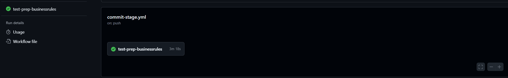
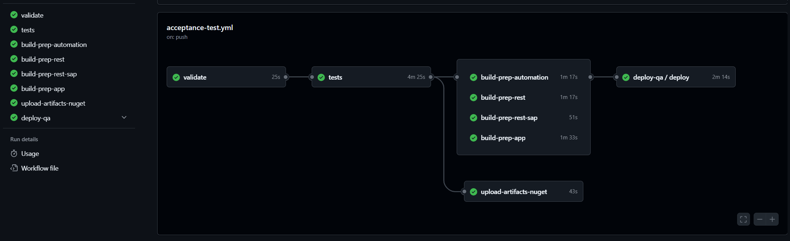
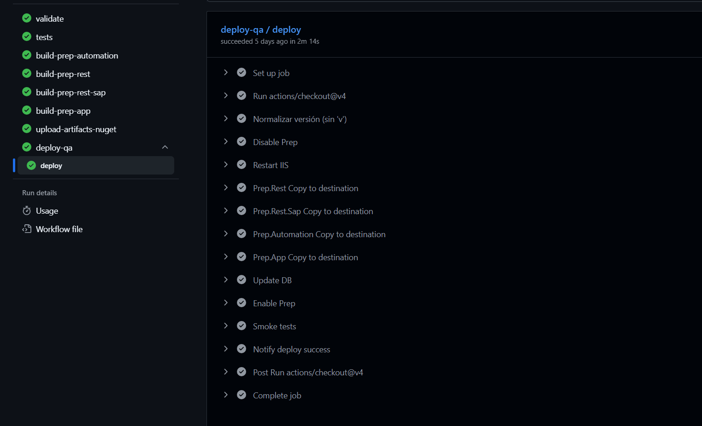

## Construcción en vivo del roadmap de Entrega Continua: ¿Cómo se hace CI/CD en la vida real?

### El caso: Empresa manufacturera del rubro papelero

#### La empresa

- 2.000 clientes
- Generación de pedido, orden de trabajo y despacho
- Stack: .NET + SQL Server, monolito, 10 años de vida
    - Aplicación de escritorio
    - Web para clientes
    - App móvil para vendedores
    - API
    - Integración con SAP
- Sin pruebas automatizadas, sin pipeline de despliegue
- Repositorio en GitHub
- Solución en los servidores locales del cliente

##### Síntomas

- Deploys muy poco frecuentes, con procesos manuales y mucha incertidumbre
- Ramas: feature branches de 2-3 semanas
- DB: migraciones automaticas con Entity Framework

> Se decide implementar Entrega Continua para mejorar la salud del proyecto.

##### Estado inicial

- Pruebas unitarias mínimas que solo ayudan a funcionalidades muy concretas
- Sin pruebas de aceptación
- Sin pruebas de integración
- Despliegues en QA y PROD de manera manual a demanda

> Se decide empezar a dar soluciones positivas con las herramientas ya utilizadas

##### Arquitectura

```text
Diagrama de componentes

  +---------------------------------------------------------------------------+
  |                              CLIENTES                                     |
  +---------------------------------------------------------------------------+
  |   +----------------+   +----------------+   +----------------+            |
  |   | <<component>>  |   | <<component>>  |   | <<component>>  |            |
  |   |   Prep.App     |   |  Mobile App    |   |   Web App      |            |
  |   | (WPF Desktop)  |   |   (externa)    |   |   (externa)    |            |
  |   +-------+--------+   +-------+--------+   +--------+-------+            |
  +-----------|--------------------|---------------------|--------------------+
              |     HTTPS / JSON   |   HTTPS / JSON      |   HTTPS / JSON
              v                    v                     v
  +---------------------------------------------------------------------------+
  |              CAPA DE APIS  (servidor de aplicaciones)                     |
  +---------------------------------------------------------------------------+
  |                                                                           |
  |   +---------------------------+       +--------------------------------+  |
  |   |       <<component>>       |--HTTP>|        <<component>>           |  |
  |   |        Prep.Rest          |       |       Prep.Rest.Sap            |  |
  |   |   (API principal)         |       |   (Adapter hacia SAP)          |  |
  |   +-------------+-------------+       +--------------+-----------------+  |
  |                 |                                    |                    |
  +-----------------|------------------------------------|--------------------+
                    |                                    |  RFC / BAPI
                    |                                    v
                    |                          +-----------------+
                    |                          | <<external>>    |
                    |                          |    SAP ERP      |
                    |                          +-----------------+
                    v
  +---------------------------------------------------------------------------+
  |                          LOGICA DE NEGOCIO                                |
  |                                                                           |
  |   +----------------------------+     +-------------------------------+    |
  |   |       <<component>>        |     |        <<component>>          |    |
  |   | ApplicationBusinessRules   |---->|   EnterpriseBusinessRules     |    |
  |   |       (Use Cases)          |     |   (Services por accion)       |    |
  |   +------------+---------------+     +---------------+---------------+    |
  +----------------|-------------------------------------|--------------------+
                   |                                     |
                   v        (via interfaces Prep.DAO)    v
  +---------------------------------------------------------------------------+
  |                         INFRASTRUCTURE                                    |
  |                                                                           |
  |   +-----------------+    +------------------+    +------------------+     |
  |   |  <<component>>  |    |  <<component>>   |    |  <<component>>   |     |
  |   |    Prep.DAO     |<---|  Prep.DAO.Sql    |--->|    Prep.ORM      |     |
  |   |  (interfaces)   |    |  (implementa)    |    |   (EF wrapper)   |     |
  |   +-----------------+    +--------+---------+    +--------+---------+     |
  +--------------------------------|------------------------|-----------------+
                                    |         ADO.NET       |
                                    v                       v
                           +--------------+        +-----------------+
                           | <<database>> |        |  <<database>>   |
                           |   Pedidos    |        |     BI DW       |
                           +--------------+        +-----------------+
```

```text
  Diagrama de despliegue

  +-----------------------+   +----------------------+   +---------------------+
  |  <<device>>           |   |  <<device>>          |   |  <<device>>         |
  |  Puesto Windows       |   |  Smartphone          |   |  Navegador          |
  |                       |   |                      |   |                     |
  |  [Prep.App.exe]       |   |  [Mobile.apk/.ipa]   |   |  [Web App]          |
  +----------+------------+   +----------+-----------+   +----------+----------+
             |                           |                          |
             +---------------------------+--------------------------+
                                         |  HTTPS
                                         v
                      +---------------------------------------+
                      |  <<server>>  Servidor de aplicaciones |
                      |  (IIS)                                |
                      |                                       |
                      |  [Api-Prep]       (Prep.Rest)         |
                      |  [Api-Prep-Sap]   (Prep.Rest.Sap)     |
                      +---------------------------------------+


    +----------------------------+
    |  <<server>>  Automation    |
    |                            |
    |  [Prep.Automation.exe]     |
    |  (Scheduled Task)          |
    +----------------------------+

```
##### Pipelines commit-stage



##### Pipelines acceptance-test



##### Deploy en QA



#### Primeros pasos

###### 1 - Hacer que integrar sea sencillo

| Pasos | Iniciativa|
|---|---|
| 1 | Agregar un pipeline de despliegue solo con las pruebas existentes |
| 2 | Agregar al pipeline el despliegue en el ambiente de QA con versionado en tag |

- Adopción de trunk-based
- Compromiso para crear pruebas en cada código que se agrega o cambia

###### 2 - Ganar seguridad ante el cambio

| Pasos | Iniciativa|
|---|---|
| 3 | Creación de pruebas de aceptación de los procesos más críticos del negocio |
| 4 | Agregar al pipeline el despliegue a producción bajo demanda |
| 5 | Creación de pruebas de integración con algunos endpoints crítios de la API |
| 6 | Creación de pruebas de integración con SAP |

###### 3 - Desacoplar deploy de release.

| Pasos | Iniciativa
|---|---|
| 7 | División de pipeline por commit-stage, acceptance y release |

### Pasos en orden cronológico (arrancando en septiembre del 2025)

1. CI básico — tests en cada push
Primer workflow que corría pruebas unitarias sobre cada commit al repo. Sin build ni deploy, solo feedback de "compila + tests verdes".

2. Build + deploy automatizado con dotnet ef
Se agregó el pipeline que ya buildeaba los proyectos y aplicaba migraciones de EF como paso del deploy, sacando esa responsabilidad de la app al arrancar.

3. Pipeline de producción — disparo manual
Se creó el workflow release.yml con workflow_dispatch que toma como input el tag vX.Y.Z ya desplegado en QA y lo promueve a prod. Separación clara: QA se deploya solo al taggear; prod requiere aprobación humana.

4. Segregación en jobs
El pipeline se partió en jobs paralelos: validate, tests, build-prep-app, build-prep-rest, build-prep-rest-sap, build-prep-automation. Antes era monolítico → ahora ejecuta en paralelo y falla rápido.

5. Pipeline de hotfix
Se probó un flujo separado para hotfixes pero se dio marcha atrás. Los hotfixes hoy siguen el flujo normal (tag desde dev).

6. Pruebas separadas dev / QA
Se diferenció: unitarias en cada push a dev (feedback rápido), integración/aceptación solo al taggear (más lentas, corren antes del deploy a QA). Acá se consolida el commit stage vs acceptance stage del libro de Humble.

7. Publicación de NuGets de librerías compartidas
Prep.Common y Prep.Model se empezaron a publicar al feed privado de Azure DevOps como parte del pipeline.  Permite que otros proyectos consuman versiones estables sin build local.

8. Artefactos versionados
Cada build publica en una carpeta del servidor. El deploy no recompila: solo copia los artefactos del tag. Esto cumple el principio de "build once, deploy many".

9. Tag como gate de release
Se valida que el tag venga de dev. Un tag en cualquier otra rama falla la pipeline. Evita releases accidentales.

10. Mantenimiento controlado: disable/enable + IIS reset
Se agregaron pasos Disable Prep → Restart IIS → copiar binarios → Update DB → Enable Prep. El iisreset fue necesario porque IIS mantenía los .dll bloqueados. Deploy sin errores de archivo en uso.

11. API de SAP al pipeline
Prep.Rest.Sap se sumó al build y deploy. Antes quedaba afuera y se deployaba manual.

12. Pruebas de integración con SAP
Se levantaron tests que pegan contra un SAP real (vía SAP_REST_URL), diferenciándolas de las integración contra BD local.

13. SQL Server en Docker para tests
Último paso: las pruebas de integración dejaron de depender de una instancia instalada en la VM de CI y pasaron a levantar SQL en contenedor. Entorno reproducible y aislado por corrida.

14. Smoke tests + notificación post-deploy
Después de reactivar la app, se corren tests de humo (run-tests.ps1 -Stage release) y se notifica el resultado al endpoint de la propia app.

#### Pendientes

- Deploy a prod sigue siendo totalmente manual — no hay gate/aprobación automática ni
promoción automática después de N días en QA.
- No hay rollback automático si los smoke tests de prod fallan. Hoy el rollback sería
volver a disparar release.yml con el tag anterior, a mano.
- Sin flujo de hotfix desde una rama release/* — el intento de feb se revirtió. Todo
hotfix hoy obliga a taggear desde dev.
- Paso comentado de espera de cierre de la app de escritorio (deploy.yml:55-56): se
sacó el Start-Sleep 240 sin reemplazo. No hay garantía de que los clientes desktop
hayan cerrado antes de copiar binarios.
- No hay despliegue blue/green ni canary — es un reemplazo in-place con ventana de
indisponibilidad.
- Deploy de la app desktop (Prep.App) es un copy a una ruta de red; no hay un canal de
distribución (MSIX/ClickOnce/auto-update) que avise al usuario.
- Métricas de DORA (lead time, deployment frequency, MTTR, change failure rate) no se
están midiendo.
- Secret management: AZURE_DEVOPS_PAT sí usa secrets, pero las URLs/paths sensibles
están hardcodeadas en los YAML en vez de estar en vars por entorno.

### Lo que sigue en la maduración

Lo hecho hasta acá son las bases. Lo que viene son capabilities que asumen que esas bases existen:

- **Medición real** — empezar a instrumentar lead time, frecuencia de deploy, tasa de fallas y tiempo de recuperación. Sin termómetro no hay mejora continua.
- **Observabilidad** — logs estructurados, métricas de negocio, alertas proactivas. Hoy nos enteramos de los problemas por reporte del cliente.
- **Estrategias de despliegue sin downtime** — blue/green o canary para reemplazar el deploy in-place con ventana de corte.
- **Rollback automático** — ante smoke test fallido, revertir al tag anterior sin intervención manual.
- **Infraestructura como código** — los entornos descritos en archivos versionados, no configurados a mano en servidores.
- **Distribución controlada de la app desktop** — MSIX / auto-update en vez de copy a una ruta de red.
- **Feature flags** — desacoplar release de deploy para los próximos cambios disruptivos.

### Cierre

> **CI/CD no es un conjunto de herramientas.**
> **Es un sistema de prácticas que componen código, arquitectura, testing, operación y cultura.**

Este caso arrancó en septiembre del 2025 sin pipeline, sin pruebas y con deploys manuales. Hoy cada commit dispara un proceso automatizado, los hotfixes siguen un flujo estándar y los smoke tests avisan si algo quedó roto en producción.

No es un destino al que se llega. Es una práctica que se sostiene. Y se construye en el orden que vimos durante las 10 clases: primero que integrar no duela, después ganar seguridad ante el cambio, después desacoplar deploy de release, y recién entonces pensar en lo que sigue.